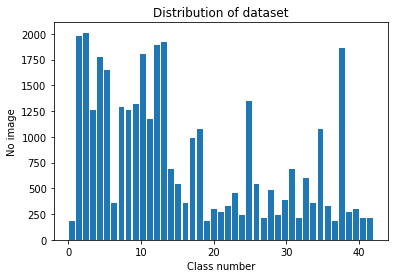
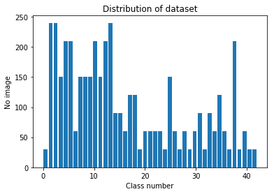
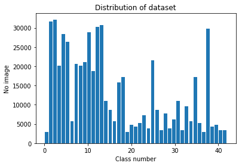
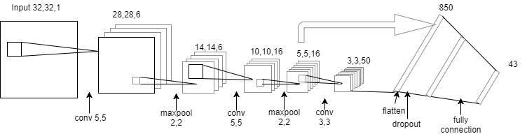
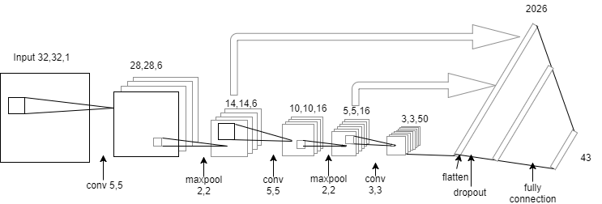
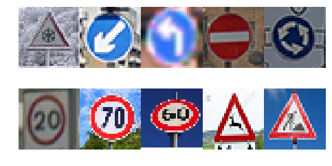
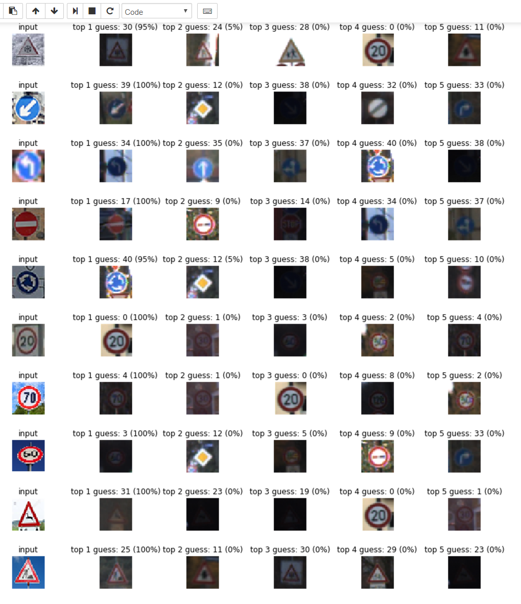

# Traffic Sign Classifier
## Overview
In this project, I used a convolutional neural network with Tensorflow in order to solve the traffic sign classifier with German traffic signs dataset. Below are the link to my source code and its HTML version:
[Source Code](Traffic_Sign_Classifier-Final.html)
[HTML Version](Traffic_Sign_Classifier-Final.html)

## Dataset summary
I used the following code to get some basic information of the [German Traffic Sign Dataset](http://benchmark.ini.rub.de/?section=gtsrb&subsection=dataset).
```python
import numpy as np
SEED = 1501
np.random.seed(SEED)
### Replace each question mark with the appropriate value. 
### Use python, pandas or numpy methods rather than hard coding the results

# Number of training examples
n_train = X_train.shape[0]

# Number of validation examples
n_validation = X_valid.shape[0]

# Number of testing examples.
n_test = X_test.shape[0]

# What's the shape of an traffic sign image?
image_shape = X_train.shape[1:]

# How many unique classes/labels there are in the dataset.
n_classes = len(np.unique(y_train))

print("Number of training examples =", n_train)
print("Number of validation examples=", n_validation)
print("Number of testing examples =", n_test)
print("Image data shape =", image_shape)
print("Number of classes =", n_classes)
```
The dataset consists of 34799 32x32 RGB training images, 4410 validation images and 12630 testing images. There are 43 number of output classes.
## Exploratory visualization of the dataset
### Explore the distribution of the training and validation dataset
I define a function to show the histogram of the dataset.
```python
import matplotlib.pyplot as plt
# Visualizations will be shown in the notebook.
%matplotlib inline

# Show the histogram of label frequency            
def show_histogram(y, n_classes):
    # histogram of label frequency
    hist, bins = np.histogram(y, bins=n_classes)
    center = (bins[:-1] + bins[1:]) / 2
    plt.title("Distribution of dataset")
    plt.xlabel("Class number")
    plt.ylabel("No image")
    plt.bar(center, hist)
    plt.show()
```
#### The distribution of training dataset
```python
show_histogram(y_train, n_classes)
```

The training dataset is very unbalanced, some classes have only about 180 images and some classes have over 1800 images.
#### The distribution of validation dataset
```python
show_histogram(y_valid, n_classes)
```

The validation dataset is also very unbalanced. However, it maintains the ratio between training and validation dataset well on each class.
#### Show some sample training images
The show sample images function
```python
import random
from pandas.io.parsers import read_csv

random.seed(SEED)

signnames = read_csv("signnames.csv").values[:, 1]
col_width = max(len(name) for name in signnames)

# Function - Show 10 random sample images for each class
def show_sample_images(labels, images, cmap=None):
    sign_classes, class_indices, class_counts = np.unique(labels, return_index = True, return_counts = True)

    for c, c_index, c_count in zip(sign_classes, class_indices, class_counts):
        print("Class %i: %-*s  %s samples" % (c, col_width, signnames[c], str(c_count)))
        fig = plt.figure(figsize = (18, 3))
        fig.subplots_adjust(left = 0, right = 1, bottom = 0, top = 1, hspace = 0.05, wspace = 0.05)
        random_indices = random.sample(range(c_index, c_index + c_count), 10)
        for i in range(10):
            axis = fig.add_subplot(1, 10, i + 1, xticks=[], yticks=[])
            if cmap == 'gray':
                axis.imshow(images[random_indices[i]].squeeze(), cmap='gray')
            else:
                axis.imshow(images[random_indices[i]])
        plt.show()
        print("--------------------------------------------------------------------------------------\n")
```
Let's show some sample images
```python
show_sample_images(y_train, X_train)
```
Please refer to the [source code](Traffic_Sign_Classifier-Final.ipynb) to see the result of this function. The images are significant different in term of contrast and brightness.
## Data preprocessing and augmentation
### Convert to grayscale images
According the [Traffic Sign Classification article of Pierre Sermanet and Yann LeCun ](http://yann.lecun.com/exdb/publis/pdf/sermanet-ijcnn-11.pdf), coverting the images to grayscale worked well and it also helps reduce the training time.
```python
# Convert images to grayscale
def grayscale_images(images):
    return np.sum(images/3, axis=3, keepdims=True)

# Convert to grayscale images
X_train_gray = grayscale_images(X_train)
X_valid_gray = grayscale_images(X_valid)
```
### Normalize images
Normalizing images helps the traing process for each feature to have a similar range so that out gradient descent don't go out of control. The normalized images don't change the output of the image on traffic sign classifier as some normalized images showing as below.
```python
# Normalized images
def normalized_images(images):
    return (images - 128)/128

# Normalized images
X_train_normalized = normalized_images(X_train_gray)
X_valid_normalized = normalized_images(X_valid_gray)
```
### Augment the data
#### Translate image
Translating image with a small pixels (3 pixels) in x,y directions doesn't change the meaning of image.
```python
import cv2

# Translate a random up to about 3 pixels in x, y directions
def translate_image(img, px = 3):
    rows,cols,_ = img.shape
    dx,dy = np.random.randint(-px,px,2)

    M = np.float32([[1,0,dx],[0,1,dy]])
    dst = cv2.warpAffine(img,M,(cols,rows))
    dst = dst[:,:,np.newaxis]
    
    return dst

test_img = X_train_normalized[1523]
test_dsts = []
test_dsts.append(test_img)
for i in range(9):
    test_dsts.append(translate_image(test_img))

show_images(test_dsts, cols = 10, cmap='gray')
```
#### Scale image
Scaling image randomly from -2 to 2 doesn't change the meaning of traffic sign output.
```python
# Scale image randomly from -2 to 2
def scale_image(img, lower_limit=-2, upper_limit=2):   
    rows,cols,_ = img.shape
    # transform limits
    px = np.random.randint(lower_limit,upper_limit)

    # ending locations
    pts1 = np.float32([[px,px],[rows-px,px],[px,cols-px],[rows-px,cols-px]])

    # starting locations (4 corners)
    pts2 = np.float32([[0,0],[rows,0],[0,cols],[rows,cols]])

    M = cv2.getPerspectiveTransform(pts1,pts2)

    dst = cv2.warpPerspective(img,M,(rows,cols))
    
    dst = dst[:,:,np.newaxis]
    
    return dst

test_scale = []
test_scale.append(test_img)
for i in range(9):
    test_scale.append(scale_image(test_img, -3, 3))

show_images(test_scale)
```
#### Warp image
The traffic signs can be viewed from different viewpoints without changing the meaning, so we can warp traffic signs images in order to increate the dataset.
```python
def warp_image(img):
    
    rows,cols,_ = img.shape

    # random scaling coefficients
    rndx = np.random.rand(3) - 0.5
    rndx *= cols * 0.09   # this coefficient determines the degree of warping
    rndy = np.random.rand(3) - 0.5
    rndy *= rows * 0.09

    # 3 starting points for transform, 1/4 way from edges
    x1 = cols/4
    x2 = 3*cols/4
    y1 = rows/4
    y2 = 3*rows/4

    pts1 = np.float32([[y1,x1],
                       [y2,x1],
                       [y1,x2]])
    pts2 = np.float32([[y1+rndy[0],x1+rndx[0]],
                       [y2+rndy[1],x1+rndx[1]],
                       [y1+rndy[2],x2+rndx[2]]])

    M = cv2.getAffineTransform(pts1,pts2)

    dst = cv2.warpAffine(img,M,(cols,rows))
    
    dst = dst[:,:,np.newaxis]
    
    return dst

test_warp = []
test_warp.append(test_img)
for i in range(9):
    test_warp.append(warp_image(test_img))
    
show_images(test_warp)
```
#### Brightness image
Random changing the brightness with small number can increate the dataset size and the variance of data.
```python
def brightness_image(img, limit = 1.0):
    shifted = img + limit  
    img_max_value = max(shifted.flatten())
    max_coef = 2.0/img_max_value
    min_coef = max_coef - 0.1
    coef = np.random.uniform(min_coef, max_coef)
    dst = shifted * coef - limit
    return dst

test_brightness = []
test_brightness.append(test_img)

for i in range(9):
    test_brightness.append(brightness_image(test_img))
    
show_images(test_brightness)
```
#### Putting it together - augment image
The translate, scale, warp and brightness image functions work fine. Now, it's time to put everything together in order to implement the augment image function. The show images testing function shows the augmented images are good and don't change the meaning of the original image.
```python
def augment_image(img):
    return translate_image(scale_image(warp_image(brightness_image(img))))

test_augs = []
test_augs.append(test_img)
for i in range(9):
    test_augs.append(augment_image(test_img))

show_images(test_augs)
```
I have tested the augment image function by randomly one image per class. The result shows that the augmented are some different from the original image and not change the meaning of traffic sign of the original image.
```python
# Test augment one image for each class
sign_classes, class_indices, class_counts = np.unique(y_train, return_index = True, return_counts = True)

for c, c_index, c_count in zip(sign_classes, class_indices, class_counts):
    print("Class %i: %-*s" % (c, col_width, signnames[c]))
    fig = plt.figure(figsize = (18, 3))
    fig.subplots_adjust(left = 0, right = 1, bottom = 0, top = 1, hspace = 0.05, wspace = 0.05)
    random_index = random.sample(range(c_index, c_index + c_count), 1)
    random_image = X_train_normalized[random_index[0]]
    
    for i in range(10):
        axis = fig.add_subplot(1, 10, i + 1, xticks=[], yticks=[])
        axis.imshow(augment_image(random_image).squeeze(), cmap='gray')
    plt.show()
    print("--------------------------------------------------------------------------------------\n")
```
I have tried to augment the training dataset by 15 times and keep the same unbalanced distribution of dataset. It was a very difficult to decide between make the traing dataset become balanced but not much data and augment the traing dataset as much as possible. I finally choose the maximum data augmentation option after comparing two approaches.
```python
def augment_mass_train_images(images, labels, n_aug=15):
    sign_classes, class_indices, class_counts = np.unique(labels, return_index = True, return_counts = True)
    images_aug = []
    labels_aug = []
    n_aug = 15
    n_augs = []
    for c, c_index, c_count in zip(sign_classes, class_indices, class_counts):
        print("Processing Class %i: %-*s  %s samples" % (c, col_width, signnames[c], str(c_count)))
        n_augs.append(n_aug)
        for i in range(c_index, c_index + c_count):
            img = images[i]
            y = labels[i]
            images_aug.append(img)
            labels_aug.append(y)
            for j in range(n_aug):
                new_img = augment_image(img)
                images_aug.append(new_img)
                labels_aug.append(y)
            if i%10 == 0:
                print('-', end='')
            if i%50 == 0:
                print('|', end='')
        
        print()
        print("After augumentation size:", (c_count + 1)*n_aug)
        print("--------------------------------------------------------------------------------------\n")
    return images_aug, labels_aug, n_augs
    
    X_train_final, y_train_final, n_augs = augment_mass_train_images(X_train_normalized, y_train, n_aug=15)
```
The distribution of augmented traing dataset does not change. The size of traing dataset after augmentation is 556784 images. It's bigger than the original traing dataset 15 times.
```python
show_histogram(y_train_final, n_classes)
```

## Model Architecture

I have choosen the Multi-Scale Convulations Network model architecture from [Pierre Sermanet and Yann LeCun paper](http://yann.lecun.com/exdb/publis/pdf/sermanet-ijcnn-11.pdf) because I think it's effective and not required many computation resouce that match with my local computer. I also apply the dropout with dropout_pro=0.5 to the fully connected layer in order to reduce the overfitting issue.
```python
import tensorflow as tf

from tensorflow.contrib.layers import flatten

keep_prob = tf.placeholder(tf.float32)
#keep_prob_conv1  = tf.placeholder(tf.float32)
#keep_prob_conv2 = tf.placeholder(tf.float32)
# Multi-Scale Convolutional Neural Networks - Pierre Sermanet and Yann LeCun
# http://yann.lecun.com/exdb/publis/pdf/sermanet-ijcnn-11.pdf

def LeNet_Pierre_Yann(x, mu=0, sigma=0.1):
     # Layer 1: Convolutional. Input = 32x32x1. Output = 28x28x6.
    # Need a filter height, width = 5 - strides 2 - VALID PADDING
    # VALID Padding, the output height and width are computed as:
    #out_height = ceil(float(in_height - filter_height + 1) / float(strides[1]))
    # (32-5 + 1)/1
    conv1_weights = tf.Variable(tf.truncated_normal(shape=(5,5,1,6), mean = mu, stddev = sigma))
    conv1_bias = tf.Variable(tf.zeros(6))
    conv1_strides = [1, 1, 1, 1]
    conv1_padding = 'VALID'
    conv1_layer = tf.nn.bias_add(tf.nn.conv2d(x, conv1_weights, conv1_strides, conv1_padding), conv1_bias)
    
     # Activation.
    # Choose relu
    conv1_layer = tf.nn.relu(conv1_layer)
    # Pooling. Input = 28x28x6. Output = 14x14x6.
    # SAME Padding
    # out_height = ceil(float(in_height) / float(strides[1]))
    conv1_pksize = [1,2,2, 1]
    conv1_pstrides = [1,2,2, 1]
    conv1_kpadding = 'VALID'
    conv1_layer = tf.nn.max_pool(conv1_layer, conv1_pksize, conv1_pstrides, conv1_kpadding)
    
     # Dropout
    #conv1_layer = tf.nn.dropout(conv1_layer, keep_prob_conv1)
    
     # Layer 2: Convolutional. Output = 10x10x16.
    # Input from layer 1: 14x14x6
    # (14-5+1)/1 - filter width - height = 5, strides 1
    conv2_weights = tf.Variable(tf.truncated_normal(shape=(5,5,6,16), mean = mu, stddev = sigma))
    conv2_bias = tf.Variable(tf.zeros(16))
    conv2_strides = [1, 1, 1, 1]
    conv2_padding = 'VALID'
    conv2_layer = tf.nn.bias_add(tf.nn.conv2d(conv1_layer, conv2_weights, conv2_strides, conv2_padding), conv2_bias)
    # Activation.
    # Choose RELU
    conv2_layer = tf.nn.relu(conv2_layer)
    # Pooling. Input = 10x10x16. Output = 5x5x16.
    # SAME PADDING with strides = 2
    conv2_pksize = [1, 2, 2, 1]
    conv2_pstrides = [1, 2, 2, 1]
    conv2_ppadding = 'VALID'
    conv2_layer = tf.nn.max_pool(conv2_layer, conv2_pksize, conv2_pstrides, conv2_ppadding)
     # Dropout
    #conv2_layer = tf.nn.dropout(conv2_layer, keep_prob_conv2)
    
    
    # Layer 3: Convolutional. Input: 5x5x16
    # Filter 3,3, 50
    # Output (5 - 3 + 1)/1 = 3 => 3x3x50
    conv3_weights = tf.Variable(tf.truncated_normal(shape=(3,3,16,50), mean = mu, stddev = sigma))
    conv3_bias = tf.Variable(tf.zeros(50))
    conv3_strides = [1,1,1,1]
    conv3_padding = 'VALID'
    conv3_layer = tf.nn.bias_add(tf.nn.conv2d(conv2_layer, conv3_weights, conv3_strides, conv3_padding), conv3_bias)
    
    # RELU activation
    conv3_layer = tf.nn.relu(conv3_layer)
    
    
    # Flatten layer 1 - Input = 14x14x6. Output = 1176.
    #fc_layer1_flat = flatten(conv1_layer)
    
    # Flatten layer 2 - Input = 5x5x16. Output = 400.
    fc_layer2_flat = flatten(conv2_layer)
    
    # Flatten layer 3 - Input = 3x3x50. Output = 450
    fc_layer3_flat = flatten(conv3_layer)
    
    # Concat layer 2 flat and layer 3 flat. Input = 400 + 450. Output = 850
    fc = tf.concat([fc_layer2_flat, fc_layer3_flat], 1)
    
     # Dropout
    fc_dropout = tf.nn.dropout(fc, keep_prob)
    
    # TODO: Layer 4: Fully Connected. Input = 850. Output = 43.
    fc1_w = tf.Variable(tf.truncated_normal(shape=(850, 43), mean = mu, stddev = sigma))
    fc1_b = tf.Variable(tf.zeros(43))    
    logits = tf.add(tf.matmul(fc_dropout, fc1_w), fc1_b)
    
    return logits
```
## Model Training
```python
x = tf.placeholder(tf.float32, (None, 32, 32, 1))
y = tf.placeholder(tf.int32, (None))
one_hot_y = tf.one_hot(y, 43)
EPOCHS = 50
BATCH_SIZE = 256


learning_rate  = 0.001
#learning_rate = 0.0001
#learning_rate = 0.0009

#logits = LeNet(x)
logits = LeNet_Pierre_Yann(x)
cross_entropy = tf.nn.softmax_cross_entropy_with_logits(labels=one_hot_y, logits=logits)
loss_operation = tf.reduce_mean(cross_entropy)
optimizer = tf.train.AdamOptimizer(learning_rate = learning_rate)
training_operation = optimizer.minimize(loss_operation)
```
I use the Adam Optimizer with the softmax cross entropy loss function. The learning rate is 0.001, 50 EPOCHS and BATCH SIZE is 256. Below is the evaluate function.
```python
correct_prediction = tf.equal(tf.argmax(logits, 1), tf.argmax(one_hot_y, 1))
accuracy_operation = tf.reduce_mean(tf.cast(correct_prediction, tf.float32))
saver = tf.train.Saver()

def evaluate(X_data, y_data):
    num_examples = len(X_data)
    total_accuracy = 0
    sess = tf.get_default_session()
    for offset in range(0, num_examples, BATCH_SIZE):
        batch_x, batch_y = X_data[offset:offset+BATCH_SIZE], y_data[offset:offset+BATCH_SIZE]
        accuracy = sess.run(accuracy_operation, feed_dict={x: batch_x, y: batch_y, keep_prob: 1.0 })
        total_accuracy += (accuracy * len(batch_x))
    return total_accuracy / num_examples
```
And the training code and result. The validation accuracy is 97.8%.
```python
from timeit import default_timer as timer

# Shuffle data
from sklearn.utils import shuffle

X_train_final, y_train_final = shuffle(X_train_final, y_train_final)

validation_accuracies = []
start_time = timer()
with tf.Session() as sess:
    sess.run(tf.global_variables_initializer())
    num_examples = len(X_train_final)
    
    
    print("Training numer of images:", num_examples)
    print("Validation number of images:", len(X_valid_final) )
    print("Augment data strategy: Maximum augment training data (15)")
    print("learning rate = ", learning_rate)
    print("EPOCHS = ", EPOCHS)
    print("BATCH_SIZE = ", BATCH_SIZE)
    print("Drop out = 0.5")
    print()
    for i in range(EPOCHS):
        start_epoch_time = timer()
        X_train_final, y_train_final = shuffle(X_train_final, y_train_final)
        for offset in range(0, num_examples, BATCH_SIZE):
            end = offset + BATCH_SIZE
            batch_x, batch_y = X_train_final[offset:end], y_train_final[offset:end]
            sess.run(training_operation, feed_dict={x: batch_x, y: batch_y, keep_prob: 0.5})
            if (offset % 200 == 0):
                print('-', end='' )
            if (offset % 900 == 0):
                print('|', end='' )
                
            
        
        end_epoch_time = timer()
        duration_epoch = (end_epoch_time - start_epoch_time)/60
        #training_accuracy = evaluate(X_train_final, y_train_final)
        print()
        print("EPOCH {} ...".format(i+1))
        print("Training time: %4.2f mins"  %duration_epoch)
        validation_accuracy = evaluate(X_valid_final, y_valid_final)
        validation_accuracies.append(validation_accuracy)
        end_valid_epoch_time = timer()
        duration_valid_epoch = (end_valid_epoch_time - start_epoch_time) / 60
        print("Included validation time: %4.2f mins"  %duration_valid_epoch)
        #print("Tranning Accuracy = {:.3f}".format(training_accuracy))
        print("Validation Accuracy = {:.3f}".format(validation_accuracy))
        print()
        
    end_time = timer()
    duration = (end_time - start_time)/60
    print("Duration time: %4.2f mins" %duration)
    #saver.save(sess, './lenet')
    saver.save(sess, './LeNetYann-10')
    print("Model saved")
```

Training numer of images: 556784
Validation number of images: 4410
Augment data strategy: Maximum augment training data (15)
learning rate =  0.001
EPOCHS =  50
BATCH_SIZE =  256
Drop out = 0.5

-|---------|---------|---------|---------|---------|---------|---------|---------|---------|-----
EPOCH 1 ...
Training time: 2.78 mins
Included validation time: 2.79 mins
Validation Accuracy = 0.923

-|---------|---------|---------|---------|---------|---------|---------|---------|---------|-----
EPOCH 2 ...
Training time: 2.76 mins
Included validation time: 2.77 mins
Validation Accuracy = 0.946

-|---------|---------|---------|---------|---------|---------|---------|---------|---------|-----
EPOCH 3 ...
Training time: 2.76 mins
Included validation time: 2.77 mins
Validation Accuracy = 0.951

-|---------|---------|---------|---------|---------|---------|---------|---------|---------|-----
EPOCH 4 ...
Training time: 2.76 mins
Included validation time: 2.77 mins
Validation Accuracy = 0.968

-|---------|---------|---------|---------|---------|---------|---------|---------|---------|-----
EPOCH 5 ...
Training time: 2.76 mins
Included validation time: 2.77 mins
Validation Accuracy = 0.965

-|---------|---------|---------|---------|---------|---------|---------|---------|---------|-----
EPOCH 6 ...
Training time: 2.76 mins
Included validation time: 2.77 mins
Validation Accuracy = 0.973

-|---------|---------|---------|---------|---------|---------|---------|---------|---------|-----
EPOCH 7 ...
Training time: 2.77 mins
Included validation time: 2.77 mins
Validation Accuracy = 0.973

-|---------|---------|---------|---------|---------|---------|---------|---------|---------|-----
EPOCH 8 ...
Training time: 2.76 mins
Included validation time: 2.77 mins
Validation Accuracy = 0.976

-|---------|---------|---------|---------|---------|---------|---------|---------|---------|-----
EPOCH 9 ...
Training time: 2.76 mins
Included validation time: 2.77 mins
Validation Accuracy = 0.978

-|---------|---------|---------|---------|---------|---------|---------|---------|---------|-----
EPOCH 10 ...
Training time: 2.77 mins
Included validation time: 2.78 mins
Validation Accuracy = 0.980

-|---------|---------|---------|---------|---------|---------|---------|---------|---------|-----
EPOCH 11 ...
Training time: 2.77 mins
Included validation time: 2.77 mins
Validation Accuracy = 0.974

-|---------|---------|---------|---------|---------|---------|---------|---------|---------|-----
EPOCH 12 ...
Training time: 2.77 mins
Included validation time: 2.77 mins
Validation Accuracy = 0.977

-|---------|---------|---------|---------|---------|---------|---------|---------|---------|-----
EPOCH 13 ...
Training time: 2.77 mins
Included validation time: 2.77 mins
Validation Accuracy = 0.980

-|---------|---------|---------|---------|---------|---------|---------|---------|---------|-----
EPOCH 14 ...
Training time: 2.77 mins
Included validation time: 2.78 mins
Validation Accuracy = 0.981

-|---------|---------|---------|---------|---------|---------|---------|---------|---------|-----
EPOCH 15 ...
Training time: 2.85 mins
Included validation time: 2.85 mins
Validation Accuracy = 0.983

-|---------|---------|---------|---------|---------|---------|---------|---------|---------|-----
EPOCH 16 ...
Training time: 2.76 mins
Included validation time: 2.77 mins
Validation Accuracy = 0.971

-|---------|---------|---------|---------|---------|---------|---------|---------|---------|-----
EPOCH 17 ...
Training time: 2.77 mins
Included validation time: 2.78 mins
Validation Accuracy = 0.983

-|---------|---------|---------|---------|---------|---------|---------|---------|---------|-----
EPOCH 18 ...
Training time: 2.77 mins
Included validation time: 2.77 mins
Validation Accuracy = 0.981

-|---------|---------|---------|---------|---------|---------|---------|---------|---------|-----
EPOCH 19 ...
Training time: 2.77 mins
Included validation time: 2.78 mins
Validation Accuracy = 0.981

-|---------|---------|---------|---------|---------|---------|---------|---------|---------|-----
EPOCH 20 ...
Training time: 2.77 mins
Included validation time: 2.78 mins
Validation Accuracy = 0.978

-|---------|---------|---------|---------|---------|---------|---------|---------|---------|-----
EPOCH 21 ...
Training time: 2.86 mins
Included validation time: 2.86 mins
Validation Accuracy = 0.982

-|---------|---------|---------|---------|---------|---------|---------|---------|---------|-----
EPOCH 22 ...
Training time: 2.77 mins
Included validation time: 2.77 mins
Validation Accuracy = 0.979

-|---------|---------|---------|---------|---------|---------|---------|---------|---------|-----
EPOCH 23 ...
Training time: 2.84 mins
Included validation time: 2.85 mins
Validation Accuracy = 0.980

-|---------|---------|---------|---------|---------|---------|---------|---------|---------|-----
EPOCH 24 ...
Training time: 2.81 mins
Included validation time: 2.82 mins
Validation Accuracy = 0.981

-|---------|---------|---------|---------|---------|---------|---------|---------|---------|-----
EPOCH 25 ...
Training time: 2.82 mins
Included validation time: 2.82 mins
Validation Accuracy = 0.968

-|---------|---------|---------|---------|---------|---------|---------|---------|---------|-----
EPOCH 26 ...
Training time: 2.85 mins
Included validation time: 2.86 mins
Validation Accuracy = 0.972

-|---------|---------|---------|---------|---------|---------|---------|---------|---------|-----
EPOCH 27 ...
Training time: 2.77 mins
Included validation time: 2.77 mins
Validation Accuracy = 0.981

-|---------|---------|---------|---------|---------|---------|---------|---------|---------|-----
EPOCH 28 ...
Training time: 2.83 mins
Included validation time: 2.84 mins
Validation Accuracy = 0.965

-|---------|---------|---------|---------|---------|---------|---------|---------|---------|-----
EPOCH 29 ...
Training time: 2.77 mins
Included validation time: 2.78 mins
Validation Accuracy = 0.979

-|---------|---------|---------|---------|---------|---------|---------|---------|---------|-----
EPOCH 30 ...
Training time: 2.77 mins
Included validation time: 2.78 mins
Validation Accuracy = 0.979

-|---------|---------|---------|---------|---------|---------|---------|---------|---------|-----
EPOCH 31 ...
Training time: 2.77 mins
Included validation time: 2.77 mins
Validation Accuracy = 0.974

-|---------|---------|---------|---------|---------|---------|---------|---------|---------|-----
EPOCH 32 ...
Training time: 2.77 mins
Included validation time: 2.77 mins
Validation Accuracy = 0.977

-|---------|---------|---------|---------|---------|---------|---------|---------|---------|-----
EPOCH 33 ...
Training time: 2.76 mins
Included validation time: 2.77 mins
Validation Accuracy = 0.982

-|---------|---------|---------|---------|---------|---------|---------|---------|---------|-----
EPOCH 34 ...
Training time: 2.77 mins
Included validation time: 2.78 mins
Validation Accuracy = 0.973

-|---------|---------|---------|---------|---------|---------|---------|---------|---------|-----
EPOCH 35 ...
Training time: 2.77 mins
Included validation time: 2.77 mins
Validation Accuracy = 0.971

-|---------|---------|---------|---------|---------|---------|---------|---------|---------|-----
EPOCH 36 ...
Training time: 2.76 mins
Included validation time: 2.76 mins
Validation Accuracy = 0.975

-|---------|---------|---------|---------|---------|---------|---------|---------|---------|-----
EPOCH 37 ...
Training time: 2.76 mins
Included validation time: 2.77 mins
Validation Accuracy = 0.979

-|---------|---------|---------|---------|---------|---------|---------|---------|---------|-----
EPOCH 38 ...
Training time: 2.77 mins
Included validation time: 2.77 mins
Validation Accuracy = 0.977

-|---------|---------|---------|---------|---------|---------|---------|---------|---------|-----
EPOCH 39 ...
Training time: 2.76 mins
Included validation time: 2.76 mins
Validation Accuracy = 0.980

-|---------|---------|---------|---------|---------|---------|---------|---------|---------|-----
EPOCH 40 ...
Training time: 2.76 mins
Included validation time: 2.76 mins
Validation Accuracy = 0.979

-|---------|---------|---------|---------|---------|---------|---------|---------|---------|-----
EPOCH 41 ...
Training time: 2.76 mins
Included validation time: 2.77 mins
Validation Accuracy = 0.979

-|---------|---------|---------|---------|---------|---------|---------|---------|---------|-----
EPOCH 42 ...
Training time: 2.76 mins
Included validation time: 2.77 mins
Validation Accuracy = 0.970

-|---------|---------|---------|---------|---------|---------|---------|---------|---------|-----
EPOCH 43 ...
Training time: 2.76 mins
Included validation time: 2.76 mins
Validation Accuracy = 0.979

-|---------|---------|---------|---------|---------|---------|---------|---------|---------|-----
EPOCH 44 ...
Training time: 2.76 mins
Included validation time: 2.77 mins
Validation Accuracy = 0.974

-|---------|---------|---------|---------|---------|---------|---------|---------|---------|-----
EPOCH 45 ...
Training time: 2.76 mins
Included validation time: 2.76 mins
Validation Accuracy = 0.963

-|---------|---------|---------|---------|---------|---------|---------|---------|---------|-----
EPOCH 46 ...
Training time: 2.75 mins
Included validation time: 2.76 mins
Validation Accuracy = 0.963

-|---------|---------|---------|---------|---------|---------|---------|---------|---------|-----
EPOCH 47 ...
Training time: 2.76 mins
Included validation time: 2.77 mins
Validation Accuracy = 0.978

-|---------|---------|---------|---------|---------|---------|---------|---------|---------|-----
EPOCH 48 ...
Training time: 2.76 mins
Included validation time: 2.77 mins
Validation Accuracy = 0.955

-|---------|---------|---------|---------|---------|---------|---------|---------|---------|-----
EPOCH 49 ...
Training time: 2.76 mins
Included validation time: 2.77 mins
Validation Accuracy = 0.975

-|---------|---------|---------|---------|---------|---------|---------|---------|---------|-----
EPOCH 50 ...
Training time: 2.76 mins
Included validation time: 2.76 mins
Validation Accuracy = 0.978

Duration time: 139.06 mins
Model saved
## Validate on the test dataset
```python
X_test_gray = grayscale_images(X_test)
X_test_normalized = normalized_images(X_test_gray)
# Evaluate the test dataset

with tf.Session() as sess:
    sess.run(tf.global_variables_initializer())
    saver2 = tf.train.import_meta_graph('./LeNetYann-10.meta')
    saver2.restore(sess, "./LeNetYann-10")
    test_accuracy = evaluate(X_test_normalized, y_test)
    print("Test Set Accuracy = {:.3f}".format(test_accuracy))
```

INFO:tensorflow:Restoring parameters from ./LeNetYann-10
Test Set Accuracy = 0.967
WOW. Finally, I got the test set accuracy 96.7%
## Solution Approach
### Data preprocessing and augmentation
It's easy to regconize that the validation data is not enough for training with only 34799 records. I have implemented the augment image function that can multiple one image 15 times without changing the meaning of traffic sign. There are two data augment approaches that I need to choose: make the augment training data to be balance distribution without less data or make the augment data has more records but not balance distribution. I have tried both augment data approaches with the same model architecture and hyperparameters. The balanced distribution approach has 97.1% validation accuracy compare to the maximun data augment approach with 97.6% validation accuracy.
I have decided not augment on the validation data because it does not help on increasing the validation accuracy. The augment on validation data only give me the validation accuracy about 94.1% - it's slower than keep validation data original approach only above 76.5% validation accuracy.
### Model Architecture
I have implemented 2 simple model architectures: the original LeNet model architecture from Udacity lession and the Multi-Scale Convolutional Networks LeNet modified version from [Pierre Sermanet and Yann LeCun](http://yann.lecun.com/exdb/publis/pdf/sermanet-ijcnn-11.pdf) paper. Below are 2 architectures implementation and result:
#### LeNet Model Architecture
I followed the LeNet architecture from Udacity lession. I have added dropout function with dropout keep_prop= 0.5 to fully connected layers in order to reduce the overfitting. Below is the code:
```python
from tensorflow.contrib.layers import flatten

keep_prob = tf.placeholder(tf.float32)

def LeNet(x, mu=0, sigma=0.1):    
  
    
    # Layer 1: Convolutional. Input = 32x32x1. Output = 28x28x6.
    # Need a filter height, width = 5 - strides 2 - VALID PADDING
    # VALID Padding, the output height and width are computed as:
    #out_height = ceil(float(in_height - filter_height + 1) / float(strides[1]))
    # (32-5 + 1)/1
    conv1_weights = tf.Variable(tf.truncated_normal(shape=(5,5,1,6), mean = mu, stddev = sigma))
    conv1_bias = tf.Variable(tf.zeros(6))
    conv1_strides = [1, 1, 1, 1]
    conv1_padding = 'VALID'
    conv1_layer = tf.nn.bias_add(tf.nn.conv2d(x, conv1_weights, conv1_strides, conv1_padding), conv1_bias)
    # Activation.
    # Choose relu
    conv1_layer = tf.nn.relu(conv1_layer)
    # Pooling. Input = 28x28x6. Output = 14x14x6.
    # SAME Padding
    # out_height = ceil(float(in_height) / float(strides[1]))
    conv1_pksize = [1,2,2, 1]
    conv1_pstrides = [1,2,2, 1]
    conv1_kpadding = 'SAME'
    conv1_layer = tf.nn.max_pool(conv1_layer, conv1_pksize, conv1_pstrides, conv1_kpadding)
    
    
    # Layer 2: Convolutional. Output = 10x10x16.
    # Input from layer 1: 14x14x6
    # (14-5+1)/1 - filter width - height = 5, strides 1
    conv2_weights = tf.Variable(tf.truncated_normal(shape=(5,5,6,16), mean = mu, stddev = sigma))
    conv2_bias = tf.Variable(tf.zeros(16))
    conv2_strides = [1, 1, 1, 1]
    conv2_padding = 'VALID'
    conv2_layer = tf.nn.bias_add(tf.nn.conv2d(conv1_layer, conv2_weights, conv2_strides, conv2_padding), conv2_bias)
    # Activation.
    # Choose RELU
    conv2_layer = tf.nn.relu(conv2_layer)
    # Pooling. Input = 10x10x16. Output = 5x5x16.
    # SAME PADDING with strides = 2
    conv2_pksize = [1, 2, 2, 1]
    conv2_pstrides = [1, 2, 2, 1]
    conv2_ppadding = 'SAME'
    conv2_layer = tf.nn.max_pool(conv2_layer, conv2_pksize, conv2_pstrides, conv2_ppadding)

    # Flatten. Input = 5x5x16. Output = 400.
    fc = flatten(conv2_layer)
    
    # Layer 3: Fully Connected. Input = 400. Output = 120.
    fc1_weights = tf.Variable(tf.truncated_normal(shape=(400,120), mean=mu, stddev = sigma))
    fc1_bias = tf.Variable(tf.zeros(120))
    fc1_layer = tf.matmul(fc, fc1_weights) + fc1_bias
    # Activation.
    fc1_layer = tf.nn.relu(fc1_layer)
    
    # Dropout
    fc1_layer = tf.nn.dropout(fc1_layer, keep_prob)
    
    # Layer 4: Fully Connected. Input = 120. Output = 84.
    fc2_w = tf.Variable(tf.truncated_normal(shape=(120,84), mean=mu, stddev = sigma))
    fc2_b = tf.Variable(tf.zeros(84))
    fc2_layer = tf.matmul(fc1_layer, fc2_w) + fc2_b
    
    # Activation.
    fc2_layer = tf.nn.relu(fc2_layer)
    
    fc2_layer = tf.nn.dropout(fc2_layer, keep_prob)
       
    # Layer 5: Fully Connected. Input = 84. Output = 43.
    fc3_w = tf.Variable(tf.truncated_normal(shape=(84,43), mean=mu, stddev = sigma))
    fc3_b = tf.Variable(tf.zeros(43))
    logits = tf.matmul(fc2_layer, fc3_w) + fc3_b
    return logits
```
I got the validation accuracy is 96.9% with learning rate = 0.001, EPOCHS = 60 and BATCH SIZE = 128
#### LeNet Pierre Sermanet and Yann LeCun version
Because there is no detail on model architecture on each layer from the Pierre Sermanet and Yann LeCun paper, so I need to choose with different models. Below are 2 versions of it.
##### LeNet modified version 1

In this version, I have tried to sub sampling the output of convolution layer 1 and convolution layer 2 to the fully connection layer. I got the validation accuracy is 97.3%
##### LeNet modified version 2

It's my final model architecture because I got the better validation accuracies on it. I almost do hyper-parameters optimization on this model architecture
### Hyper-parameter optimization
I have tried with some different learning rate: 0.0001, 0.0005 and 0.001. It's easy to choose the learning rate is 0.001 because of the training accuracy increase much after about 5 - 10 EPOCHS and keep increate a little bit on it. The 0.0001 and 0.0005 are small learning rate with the training accuracy is increased slower.
I have tried the BATCH SIZE with 128 and 256 values. The 256 BATCH SIZE gives the more validation accuracy than 128 BATCH SIZE about 0.2 to 0.4% - 97.4% compare with 97.8%. Also the 256 BATCH SIZE need more time to train than the 128 BATCH SIZE but not much (about 207 minutes compare to 209 minutes). Finally, I have choosen the 256 BATCH SIZE.
I ussually choose the EPOCHS is 60. However, during the expirement, I relized that the validation accuracy does not increase so much after 30 EPOCHS. So, I have decided to reduce the EPOCHS to 50. In the future, I would like to apply the early stop approach in order to get the better validation accuracy.
### History
I kept the history, plesae refer to the logs folder to more information.
## Test a Model on new images
### Load and show the web images
```python
### Load the images and plot them here.
### Feel free to use as many code cells as needed.

import os
import matplotlib.image as mpimg

web_images = []

fig, axs = plt.subplots(2,5, figsize=(8, 4))
fig.subplots_adjust(hspace = .2, wspace=.001)
axs = axs.ravel()
for i, img in enumerate(os.listdir('./web-images/')):
    image = cv2.imread('./web-images/' + img)
    axs[i].axis('off')
    axs[i].imshow(cv2.cvtColor(image, cv2.COLOR_BGR2RGB))
    web_images.append(image)

web_images = np.asarray(web_images)
print('Image shape:', web_images.shape)
```

### Performance on new images
```python
web_images_gray = grayscale_images(web_images)
web_images_normalized = normalized_images(web_images_gray)

web_labels = [30, 39, 34, 17, 40, 0, 4, 3, 31, 25]
#web_labels = [30, 39, 34, 17, 40, 0, 4, 3]

with tf.Session() as sess:
    sess.run(tf.global_variables_initializer())
    saver3 = tf.train.import_meta_graph('./LeNetYann-10.meta')
    saver3.restore(sess, "./LeNetYann-10")
    my_accuracy = evaluate(web_images_normalized, web_labels)
    print("Web Images Set Accuracy = {:.3f}".format(my_accuracy))
```
INFO:tensorflow:Restoring parameters from ./LeNetYann-10
Web Images Set Accuracy = 1.000
It's amazing. The accuracy of web images validation is 100%. It works well with the real images from German that I found from website. And I known that it cannot work well with the Canada traffic signs system because there are some Canada traffic signs don't have in the training dataset.
### Output Top 5 Softmax Probabilities For Each Image Found on the Web
```python
### Print out the top five softmax probabilities for the predictions on the German traffic sign images found on the web. 
### Feel free to use as many code cells as needed.
top = 5
softmax_logits = tf.nn.softmax(logits)
top_k = tf.nn.top_k(softmax_logits, k=top)

with tf.Session() as sess:
    sess.run(tf.global_variables_initializer())
    saver = tf.train.import_meta_graph('./LeNetYann-10.meta')
    saver.restore(sess, "./LeNetYann-10")
    my_softmax_logits = sess.run(softmax_logits, feed_dict={x: web_images_normalized, keep_prob: 1.0})
    my_top_k = sess.run(top_k, feed_dict={x: web_images_normalized, keep_prob: 1.0})

    
    fig, axs = plt.subplots(len(web_images),top + 1, figsize=(14, 16))
    fig.subplots_adjust(hspace = .8, wspace=.4)
    axs = axs.ravel()

    for i, image in enumerate(web_images):
        axs[6*i].axis('off')
        axs[6*i].imshow(cv2.cvtColor(image, cv2.COLOR_BGR2RGB))
        axs[6*i].set_title('input')
        for j in range (top):
            guess = my_top_k[1][i][j]
            index = np.argwhere(y_train == guess)[0]
            axs[6*i+j + 1].axis('off')
            axs[6*i+j + 1].imshow(X_train[index].squeeze(), cmap='gray')
            axs[6*i+j + 1].set_title('top {} guess: {} ({:.0f}%)'.format(j + 1, guess, 100*my_top_k[0][i][j]))
```


